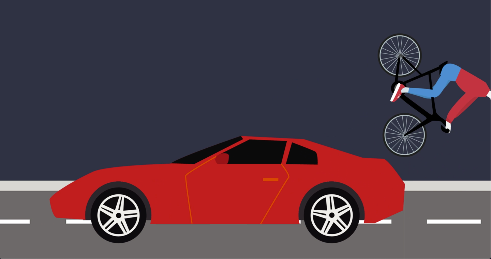
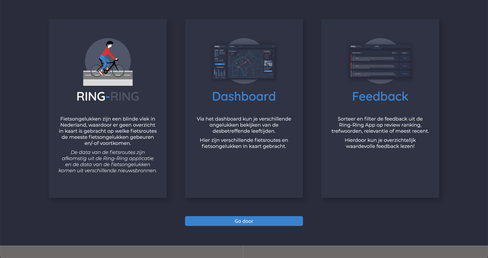
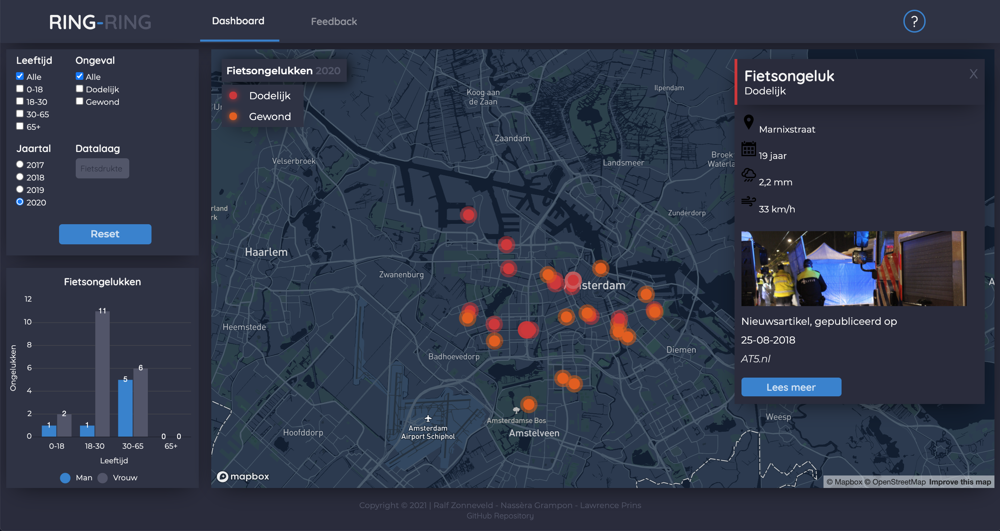
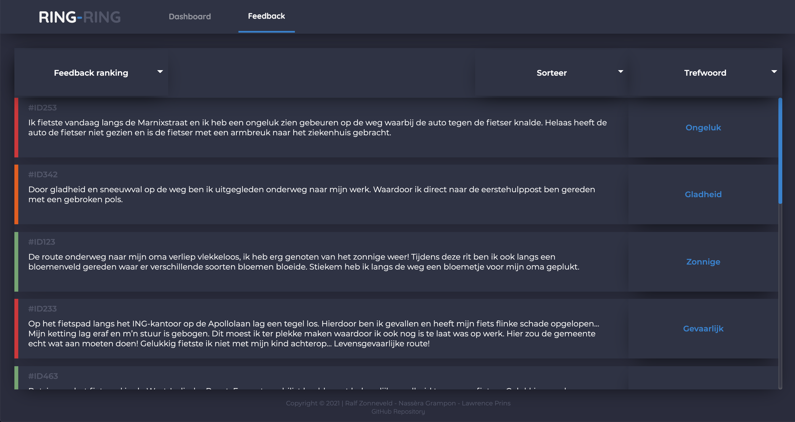

##### Project Information Design 20-21

# Ring-Ring

_Project Information Design, a course of Information Design. It is a thema semester of the third year from the study [CMD](https://www.cmd-amsterdam.nl/). In this course I will learn to create a concept for Ring-Ring in which data visualization is a mandatory part._


_A tool designed for the policy makers of Amsterdam, commissioned by the company [Ring-Ring ®](https://ring-ring.nu/) in the Netherlands._


## :page_with_curl: Case
For this course I have to create an interactive data visualization for a company. Ring-Ring is the company I have chosen for, because it's a company that strives for a better cycling environment. I like that endeavor and I agree with it! Ring-Ring has also an application where users cycle routes and the app tracks their cycled routes. Now I have been asked to make a data visualization of the data for one of the target groups (think of policy makers, insurance, stakeholders, app users).


## :heart_eyes: Concept
We have created a tool for Amsterdam policymakers in which new insights will emerge. In this dashboard, the data of cycling accidents and cycling routes come together, which has never happened before. In this way, efforts to improve cycling safety may well be achieved! This is all showed in one overview, as well as the given feedback from the Ring-Ring app users.

#### Introduction page
At the begin of the application, there is a short video (7.0s) (see below) that shows a traffic accident (the topic at stake).


The video plays


When the video is over, an overlay with an introduction text appears. It explains the entire tool in a nutshell.


The introduction overlay

## :bulb: Features
There are 2 pages in the tool; the dashboard and the feedback-page. Each page has their own features.

### Dashboard
- You can see the cycling accident data plotted on a map (red and orange circles)
- You can see the cycled routes data of January 2020 in Amsterdam plotted on a map
- There is a bar chart showing the number of cycling accidents of different age groups and sexes
- You can filter the cycling accident data by **age**, **type of accident** and **year**
- You can switch the cycled routes (cycle crowds) on and off. This filter option is **off** by default, because the focus is on the cycling accidents
- You can see the data of a specific bicycle accident in the tooltip




### Feedback
- The feedback from the Ring-Ring app users is displayed in a clear overview and can be filtered by **feedback score**, **relevance**, **most recent** and **most used keywords**




## :1234: Data

### Datasets / API's

-   [Cycled routes of January 2020 in Amsterdam (Ring-Ring)](https://ringring.jorrr.nl/geojson-data-ringring.json) (hostend on [Jordy](https://github.com/joordy)'s server)
-   [Cycling accident ](https://gist.githubusercontent.com/ralfz123/0a48d1cd9b3155c7442fe98332a9031e/raw/b8ccaf6949381f89aa90a4eb26018c912e509a5b/accidents_data-3.geojson)


#### Data structure | cycled routes (Ring-Ring)
```json
{
  "type": "FeatureCollection",
  "features": [
     {
      "type": "Feature",
      "geometry": {
        "coordinates": [
          [
            4.8996458,
            52.3695223
          ],
          [
            4.8999728,
            52.3693523
          ],
		],
        "type": "LineString"
			},
      "properties": {
        "start": "2020-01-31T22:57:40Z",
        "end": "2020-01-31T22:59:51Z",
        "duration": 2,
        "modality": 2,
        "distance": 0.16,
        "feedback score": null,
        "feedback": null,
        "weather": "zwaar bewolkt"
      }
    }
	]
}
```

#### Data structure | cycling accident
```json
{
	"type": "FeatureCollection",
	"features": [
		{
			"type": "Feature",
			"geometry": {
				"type": "Point",
				"coordinates": [4.875882387575789, 52.37217063062023]
			},
			"properties": {
				"id": 2,
				"street": "Marnixstraat/Rozengracht",
				"outcome": "dodelijk",
				"gender": "v",
				"age": 32,
				"weather": "droog",
				"year": 2019,
				"url_site": "https://www.at5.nl/artikelen/205165/het-leven-van-zahra-32-eindigde-op-een-amsterdams-kruispunt",
				"image_article_site": "https://media.at5.nl/images/464337.f75ed47.webp?width=3200&ratio=3:1&quality=80",
				"source": "AT5.nl",
				"date_publicated": "25-10-2020"
			}
		}
	]
}
```


## :red_circle: Live version

[Link to live version, click here!](https://ralfz123.github.io/ring-ring/src/index.html)


## :rocket: Install project

#### Clone repository

```bash
git clone https://github.com/ralfz123/ring-ring.git
```

#### Install project

```bash
npm i
```

#### Run the project

```bash
python -m SimpleHTTPServer 8000
```

#### Visit project

```bash
localhost:8000
```


## :file_folder: Sources
Credits to [Janine Hogendoorn](https://ring-ring.nu/author/janine/) from Ring-Ring for giving feedback and thinking along in the process and Credits to Suze for thinking along and motivating the process. Also credits to my teammates Nassèra Grampon and Lawrence Prins (for the design).

#### Map sources
- MapBox. (n.d.). Documentation Mapbox. - MapBox GL JS. Retrieved 28 December 2020, from https://docs.mapbox.com/
- MapBox. (n.d.). Installation - MapBox GL JS. Retrieved 28 December 2020, from https://docs.mapbox.com/mapbox-gl-js/api/
- MapBox. (n.d.). Studio Mapbox (styling maps) - MapBox GL JS. Retrieved  28 December 2020 from https://studio.mapbox.com/
- MapBox. (n.d.). Example Simple Map - MapBox GL JS. Retrieved 29 December 2020, from https://docs.mapbox.com/mapbox.js/example/v1.0.0/
- MapBox. (n.d.). example - MapBox GL JS. Retrieved 5 January 2021, from https://docs.mapbox.com/help/tutorials/custom-markers-gl-js/
- MapBox. (n.d.). example tooltip - MapBox GL JS. Retrieved  15 January 2021 from https://docs.mapbox.com/help/tutorials/create-interactive-hover-effects-with-mapbox-gl-js/#define-the-hover-attribute
- MapBox. (n.d.). example circle color, depends on data - MapBox GL JS. Retrieved  15 January 2021 from https://docs.mapbox.com/mapbox-gl-js/example/data-driven-circle-colors/
- MapBox. (n.d.). documentation function - MapBox GL JS. Retrieved  15 January 2021 from https://docs.mapbox.com/mapbox-gl-js/style-spec/expressions/#match


#### Chart sources
- Chart.js. (n.d.). Chart.js documentation - Chart.js. Retrieved 29 December 2020 from https://www.chartjs.org/docs/latest/
- Chart.js Datalabels plugin. (n.d.). Chart.js Datalabels plugin documentation - Chart.js Datalabels plugin. Retrieved  30 December 2020 from https://chartjs-plugin-datalabels.netlify.app/guide/getting-started.html#installation
- Chart.js. (n.d.). Chart.js documentation - Chart.js. Retrieved 6 January 2021 from https://www.chartjs.org/docs/latest/developers/plugins.html


- Chart.js. (n.d.). Chart.js Getting Started - Chart.js. Retrieved 10 January 2021 from https://www.chartjs.org/docs/latest/getting-started/usage.html
- Chart.js. (n.d.). Chart.js Accessibility - Chart.js. Retrieved 10 January 2021 from https://www.chartjs.org/docs/latest/general/accessibility.html
- Chart.js. (n.d.). Chart.js Labelling axes - Chart.js. Retrieved 11 January 2021 from https://www.chartjs.org/docs/latest/axes/labelling.html
- Chart.js. (n.d.). Chart.js Styling axes - Chart.js. Retrieved 11 January 2021 from https://www.chartjs.org/docs/latest/axes/styling.html

### Other sources
- Css-Tricks. (n.d.). A Complete Guide to Grid - Css-Tricks. Retrieved 26 December 2020 from https://css-tricks.com/snippets/css/complete-guide-grid/
- Stackoverflow (n.d.). Searching for answers on dev questions - Stackoverflow. Retrieved 20 December 2020 from https://www.stackoverflow.com


## :cop: License

This project from [Ralf](https://github.com/ralfz123) has a [MIT © License](https://github.com/ralfz123/ring-ring/blob/main/LICENSE)
